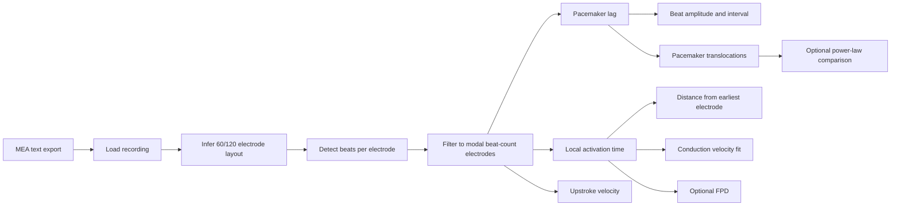

# pyMEA

Cardiomyocyte microelectrode-array (MEA) analysis for beat detection, spatial activation mapping, conduction velocity estimation, beat-amplitude tracking, and pacemaker translocation analysis.

## Method Overview

1. Import an MEA recording and infer whether it uses the 60-electrode or 120-electrode geometry.
2. Detect beats independently in each channel with amplitude and distance thresholds.
3. Keep electrodes whose beat counts match the modal beat count across the array.
4. Compute per-beat pacemaker lag, LAT, and upstroke velocity.
5. Fit a 2D polynomial activation surface to estimate conduction velocity vectors.
6. Derive beat amplitude, beat interval, and pacemaker translocation statistics.
7. Optionally estimate field potential duration (FPD).

### Analysis Components

- Beat detection: `scipy.signal.find_peaks`
- Pacemaker lag: beat-aligned minimum-time normalization across electrodes
- LAT: slope-based local timing around each detected beat
- Upstroke velocity: maximum local derivative preceding each beat
- CV: 2D polynomial surface fitting followed by spatial derivatives
- Translocations: thresholded pacemaker-origin change tracking across beats

## Pipeline Overview



## Repository Structure

```text
.
├── README.md
├── pyproject.toml
├── requirements.txt
├── configs/
│   └── analysis_example.json
├── data/
│   ├── DATA.md
│   ├── examples/
│   └── metadata/
├── results/
│   └── RESULTS.md
├── scripts/
│   ├── launch_gui.py
│   ├── run_analysis.py
│   └── run_batch.py
└── src/
    └── pymea/
        ├── analysis/
        ├── stats/
        ├── plotting/
        ├── exploratory/
        ├── gui/
        ├── core.py
        ├── io.py
        ├── export.py
        └── pipeline.py
```

## Experimental Setup

### Acquisition assumptions

- cardiomyocyte field-potential recordings from MEA hardware
- 60-electrode or 120-electrode layouts
- MC_DataTool text export as the interchange format

### Key analysis parameters

- `min_peak_height`
- `min_peak_distance`
- `sample_frequency`
- optional truncation interval
- optional silenced electrode list

### Evaluation protocol

- modal beat-count agreement across electrodes
- spatial heatmaps for pacemaker lag, LAT, upstroke velocity, and CV
- per-beat amplitude and interval statistics
- pacemaker translocation event lengths and distances
- optional property-vs-distance and power-law analyses

## Installation

```powershell
python -m venv .venv
. .venv\Scripts\Activate.ps1
pip install -r requirements.txt
pip install -e .
```

## Citation

If you use this repository, please cite the original pyMEA software and associated publication or preprint from the UCLA Gimzewski Lab.